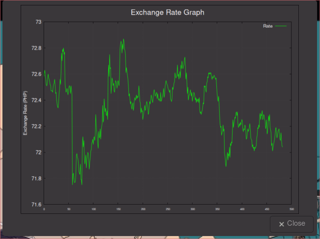
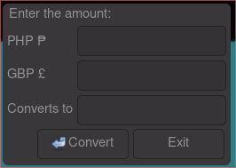

# Currency Exchange Waybar Module

This Waybar module provides a live currency exchange display and additional features to enhance your experience with currency rates.

## Features

- **Live Currency Display**: Shows real-time exchange rates between the the chosen currencies.

- **History Graph**: Clicking on the widget displays a historical graph of the exchange rates. This helps in tracking fluctuations over a period.

- **Currency Converter**: Right-clicking the widget brings up a currency converter for on-the-spot conversions between PHP and GBP.

To install:
Clone the repository / download the zip. 
Create a new folder in your /waybar/scripts/ called Currency 
Copy files to your new ~/.config/hypr/waybar/scripts/Currency/ folder.
Add the example module to your  config.jsonc
Add the example style to you style.css

Edit gbp2php.py add your wise.com API key, and the currencies you want to convert. 

Restart waybar wait a couple of minutes..

I just did this as a python exercise. 
